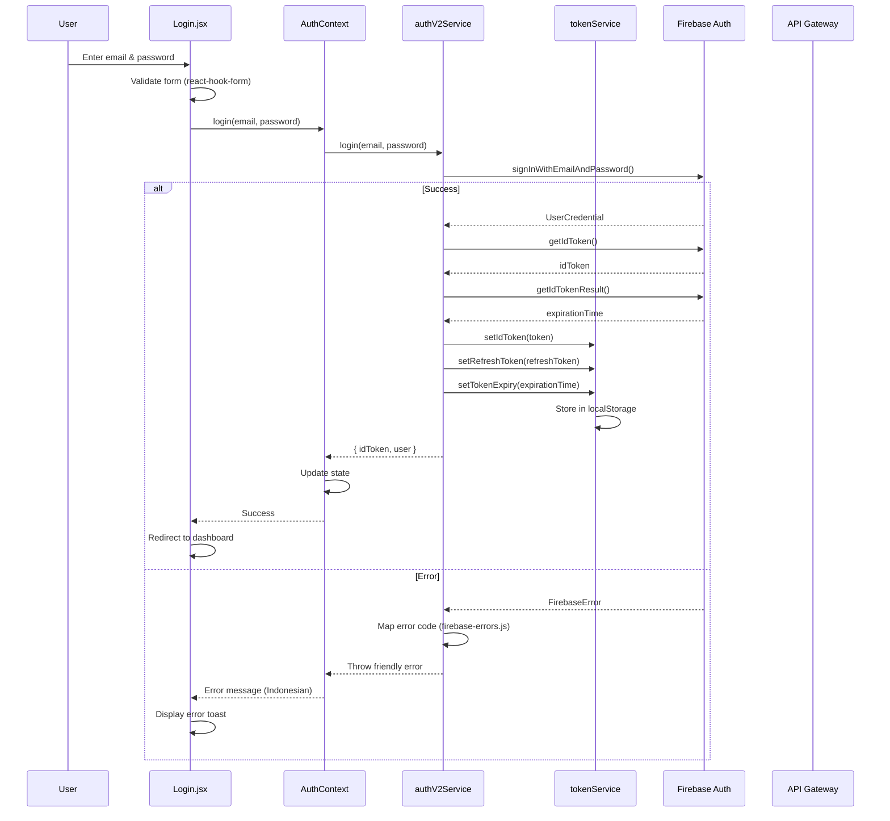
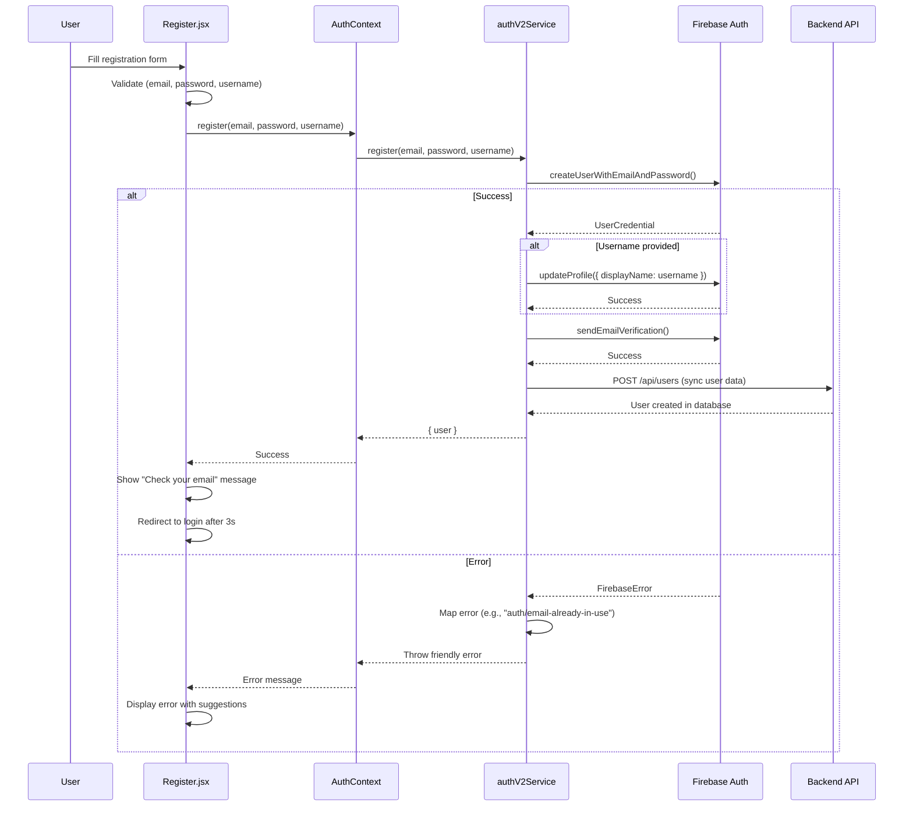
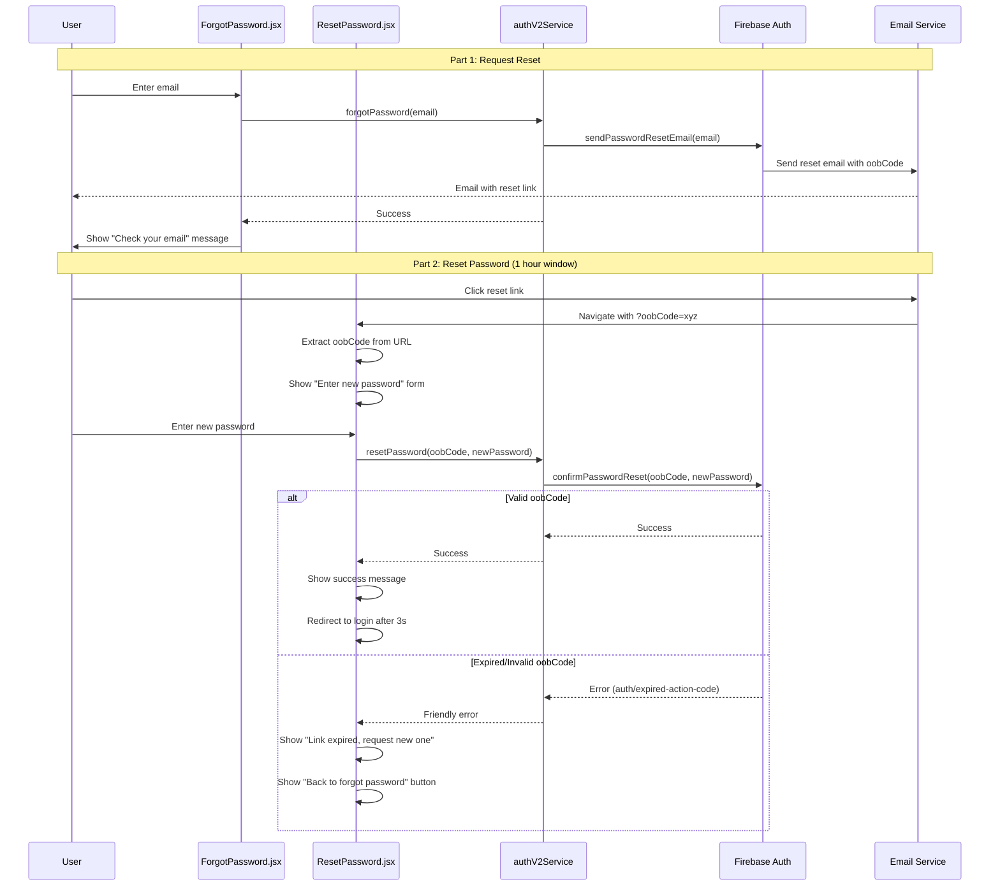
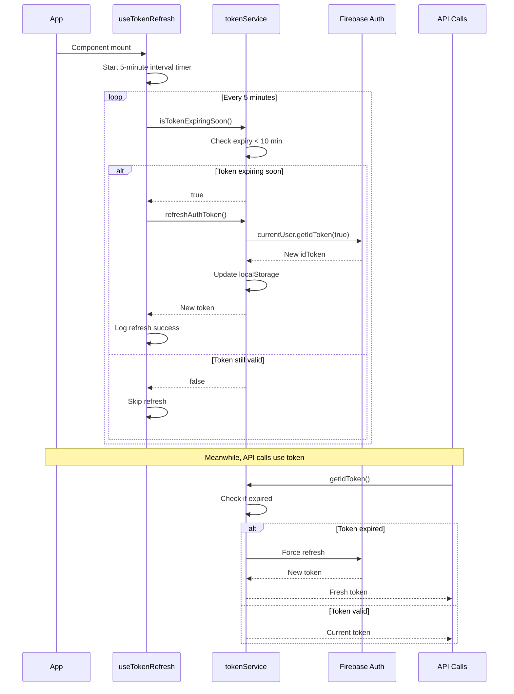
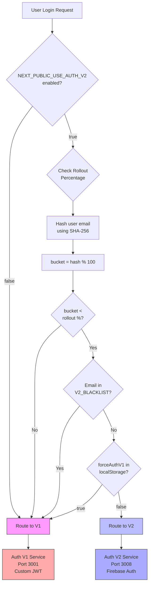

# Auth V2 Architecture & Flow Documentation

**Version**: 1.0  
**Last Updated**: 2025-10-04  
**Audience**: Engineering Team, Technical Stakeholders

---

## 📋 Table of Contents

1. [System Architecture](#system-architecture)
2. [Authentication Flows](#authentication-flows)
3. [Component Relationships](#component-relationships)
4. [Data Flow](#data-flow)
5. [Feature Flag Strategy](#feature-flag-strategy)
6. [Token Lifecycle](#token-lifecycle)
7. [Migration Strategy](#migration-strategy)

---

## 🏗️ System Architecture

### High-Level Overview

```
┌─────────────────────────────────────────────────────────────────┐
│                        Frontend (Next.js 13+)                    │
│  ┌──────────────┐  ┌──────────────┐  ┌──────────────────────┐  │
│  │ Login.jsx    │  │ Register.jsx │  │ ForgotPassword.jsx   │  │
│  └──────┬───────┘  └──────┬───────┘  └──────┬───────────────┘  │
│         │                  │                  │                   │
│         └──────────────────┴──────────────────┘                   │
│                           │                                       │
│                    ┌──────▼──────┐                               │
│                    │ AuthContext  │                               │
│                    └──────┬───────┘                               │
│         ┌─────────────────┴─────────────────┐                    │
│         │                                    │                    │
│  ┌──────▼───────┐                   ┌───────▼───────┐           │
│  │ authV2Service│                   │  tokenService  │           │
│  │  (Firebase)  │                   │ (Token Mgmt)   │           │
│  └──────┬───────┘                   └───────┬────────┘           │
│         │                                    │                    │
└─────────┼────────────────────────────────────┼────────────────────┘
          │                                    │
          │ HTTPS                              │ localStorage
          │                                    │
┌─────────▼────────────────────────────────────▼────────────────────┐
│                     API Gateway (Port 3000)                        │
│  ┌────────────────────────────────────────────────────────────┐  │
│  │  Dual Auth Router (auth-v2-config.js)                      │  │
│  │  • Checks feature flag: NEXT_PUBLIC_USE_AUTH_V2           │  │
│  │  • Checks rollout %: NEXT_PUBLIC_AUTH_V2_ROLLOUT_PERCENTAGE│  │
│  │  • Routes to V1 or V2 based on user email hash             │  │
│  └────────────┬────────────────────┬──────────────────────────┘  │
└───────────────┼────────────────────┼─────────────────────────────┘
                │                    │
       ┌────────▼──────┐    ┌────────▼──────┐
       │  Auth V1      │    │  Auth V2      │
       │  Service      │    │  Service      │
       │  (Port 3001)  │    │  (Port 3008)  │
       │               │    │               │
       │  • Custom JWT │    │  • Firebase   │
       │  • PostgreSQL │    │  • Firebase   │
       │  • Long-lived │    │  • 1h token   │
       │    tokens     │    │    expiry     │
       └───────┬───────┘    └───────┬───────┘
               │                    │
               │            ┌───────▼───────────┐
               │            │ Firebase Auth SDK  │
               │            │ (Google Cloud)     │
               │            └────────────────────┘
               │
       ┌───────▼────────┐
       │  PostgreSQL DB │
       │  (User Data)   │
       └────────────────┘
```

### Component Breakdown

#### Frontend Components

| Component | Responsibility | Key Features |
|-----------|---------------|--------------|
| **Login.jsx** | User authentication UI | Dual auth support, Firebase error handling |
| **Register.jsx** | New user registration | Optional username, email validation |
| **ForgotPassword.jsx** | Password reset initiation | Email validation, success feedback |
| **ResetPassword.jsx** | Password update | oobCode verification, strength validation |
| **ProfilePage.tsx** | User profile management | Split update strategy, account deletion |

#### Services Layer

| Service | File | Purpose |
|---------|------|---------|
| **authV2Service** | `services/authV2Service.js` | Firebase Auth API wrapper (login, register, password reset) |
| **tokenService** | `services/tokenService.js` | Token lifecycle management (store, retrieve, refresh, validate) |
| **apiService** | `services/apiService.js` | Axios interceptors for auth headers & token refresh |

#### Context & State

| Context | State | Purpose |
|---------|-------|---------|
| **AuthContext** | `user, token, authVersion, loading` | Global auth state management |
| **TokenContext** | `tokenBalance, loading, error` | Token balance for assessments |

#### Configuration

| File | Purpose |
|------|---------|
| `auth-v2-config.js` | Feature flags, rollout percentage, user bucketing |
| `firebase-errors.js` | Firebase error code → Indonesian message mapping |

---

## 🔐 Authentication Flows

### Flow 1: Login Flow (V2)



**Code Reference**:
```javascript
// Login.jsx (simplified)
const handleLogin = async (data) => {
  try {
    await login(data.email, data.password);
    router.push('/dashboard');
  } catch (error) {
    toast.error(error.message); // Already in Indonesian
  }
};

// authV2Service.js
async login(email, password) {
  const userCredential = await signInWithEmailAndPassword(
    this.auth, email, password
  );
  const idToken = await userCredential.user.getIdToken();
  tokenService.setIdToken(idToken);
  return { idToken, user: userCredential.user };
}
```

### Flow 2: Registration Flow (V2)



### Flow 3: Password Reset Flow (V2)



### Flow 4: Token Refresh Flow



**Code Reference**:
```javascript
// useTokenRefresh.ts
useEffect(() => {
  const intervalId = setInterval(async () => {
    if (tokenService.isTokenExpiringSoon()) {
      await tokenService.refreshAuthToken();
    }
  }, 5 * 60 * 1000); // 5 minutes

  return () => clearInterval(intervalId);
}, []);
```

### Flow 5: Dual Auth Routing Decision



**Code Reference**:
```javascript
// auth-v2-config.js
export function shouldUseAuthV2(userEmail) {
  // Feature flag check
  if (!USE_AUTH_V2) return false;
  
  // Force V1 check
  if (localStorage.getItem('forceAuthV1') === 'true') {
    return false;
  }
  
  // Blacklist check
  if (V2_BLACKLIST.includes(userEmail)) {
    return false;
  }
  
  // Rollout percentage check
  const hash = hashString(userEmail);
  const bucket = hash % 100;
  return bucket < ROLLOUT_PERCENTAGE;
}
```

---

## 🧩 Component Relationships

### Dependency Graph

```
┌────────────────────────────────────────────────────────────┐
│                      Application Root                       │
│                        (_app.tsx)                           │
└────────────────────────┬───────────────────────────────────┘
                         │
            ┌────────────▼────────────┐
            │    AuthProvider         │
            │   (AuthContext.tsx)     │
            └────────────┬────────────┘
                         │
         ┌───────────────┼───────────────┐
         │               │               │
┌────────▼───────┐ ┌────▼──────┐ ┌──────▼────────┐
│  Login.jsx     │ │Register.jsx│ │ ProfilePage   │
│                │ │            │ │  .tsx         │
└────────┬───────┘ └─────┬──────┘ └───────┬───────┘
         │               │                 │
         │               │                 │
         └───────────────┼─────────────────┘
                         │
         ┌───────────────┼───────────────┐
         │               │               │
┌────────▼────────┐ ┌───▼──────────┐ ┌──▼────────────┐
│ authV2Service.js│ │ tokenService │ │ apiService.js │
│                 │ │  .js         │ │               │
└────────┬────────┘ └───┬──────────┘ └───┬───────────┘
         │              │                 │
         └──────────────┴─────────────────┘
                        │
              ┌─────────▼─────────┐
              │   Firebase SDK    │
              │   (Client-side)   │
              └───────────────────┘
```

### Data Flow Between Components

```
┌─────────────────────────────────────────────────────────────┐
│  User Action (Login button click)                           │
└─────────────────────────┬───────────────────────────────────┘
                          │
                ┌─────────▼──────────┐
                │  Login.jsx         │
                │  • Validates form  │
                │  • Calls context   │
                └─────────┬──────────┘
                          │
                ┌─────────▼──────────┐
                │  AuthContext       │
                │  • Manages state   │
                │  • Calls service   │
                └─────────┬──────────┘
                          │
                ┌─────────▼──────────┐
                │  authV2Service     │
                │  • Firebase auth   │
                │  • Error handling  │
                └─────────┬──────────┘
                          │
              ┌───────────┼───────────┐
              │           │           │
     ┌────────▼────┐ ┌────▼─────┐ ┌──▼──────────┐
     │  Firebase   │ │tokenSvc  │ │  API Call   │
     │  Auth SDK   │ │(storage) │ │ (backend)   │
     └────────┬────┘ └────┬─────┘ └──┬──────────┘
              │           │           │
              └───────────┴───────────┘
                          │
                ┌─────────▼──────────┐
                │  AuthContext       │
                │  • Updates state   │
                │  • Notifies UI     │
                └─────────┬──────────┘
                          │
                ┌─────────▼──────────┐
                │  Login.jsx         │
                │  • Shows result    │
                │  • Redirects       │
                └────────────────────┘
```

---

## 💾 Data Flow

### Token Storage Strategy

```
┌─────────────────────────────────────────────────────────────┐
│                      localStorage Keys                       │
├──────────────┬──────────────────────────────────────────────┤
│ Key          │ Description                                   │
├──────────────┼──────────────────────────────────────────────┤
│ idToken      │ Firebase ID token (JWT, 1 hour expiry)       │
│ refreshToken │ Firebase refresh token (long-lived)          │
│ tokenExpiry  │ Unix timestamp when idToken expires          │
│ uid          │ Firebase user ID                             │
│ email        │ User email address                           │
│ authVersion  │ 'v1' or 'v2' (which auth system used)        │
│ forceAuthV1  │ 'true' to force V1 (troubleshooting)         │
└──────────────┴──────────────────────────────────────────────┘
```

### API Request Flow with Auth

```
┌──────────────────────────────────────────────────────────────┐
│  User Action (e.g., fetch profile)                           │
└────────────────────────┬─────────────────────────────────────┘
                         │
            ┌────────────▼────────────┐
            │  Component              │
            │  apiService.get('/api/  │
            │    user/profile')       │
            └────────────┬────────────┘
                         │
            ┌────────────▼────────────┐
            │  Axios Request          │
            │  Interceptor            │
            └────────────┬────────────┘
                         │
            ┌────────────▼────────────┐
            │  Check authVersion      │
            │  (from localStorage)    │
            └────────────┬────────────┘
                         │
         ┌───────────────┴───────────────┐
         │                               │
┌────────▼────────┐            ┌─────────▼────────┐
│  Auth V1        │            │  Auth V2         │
│  • Get 'token'  │            │  • Get 'idToken' │
│  • Add to header│            │  • Check expiry  │
│  Authorization: │            │  • Refresh if    │
│    token        │            │    needed        │
│                 │            │  • Add to header │
│                 │            │  Authorization:  │
│                 │            │    Bearer token  │
└────────┬────────┘            └─────────┬────────┘
         │                               │
         └───────────────┬───────────────┘
                         │
            ┌────────────▼────────────┐
            │  Send Request           │
            │  to Backend             │
            └────────────┬────────────┘
                         │
            ┌────────────▼────────────┐
            │  Backend Validates      │
            │  Token & Returns Data   │
            └────────────┬────────────┘
                         │
            ┌────────────▼────────────┐
            │  Axios Response         │
            │  Interceptor            │
            └────────────┬────────────┘
                         │
            ┌────────────▼────────────┐
            │  Component Receives     │
            │  Data                   │
            └─────────────────────────┘
```

### Error Handling Flow

```
┌──────────────────────────────────────────────────────────────┐
│  API Request Fails (e.g., 401 Unauthorized)                  │
└────────────────────────┬─────────────────────────────────────┘
                         │
            ┌────────────▼────────────┐
            │  Axios Response Error   │
            │  Interceptor            │
            └────────────┬────────────┘
                         │
            ┌────────────▼────────────┐
            │  Check Error Status     │
            └────────────┬────────────┘
                         │
         ┌───────────────┴───────────────┐
         │                               │
┌────────▼────────┐            ┌─────────▼────────┐
│  401            │            │  Other Errors    │
│  (Unauthorized) │            │  (500, 400, etc.)│
└────────┬────────┘            └─────────┬────────┘
         │                               │
┌────────▼────────┐                      │
│  Check Auth     │                      │
│  Version        │                      │
└────────┬────────┘                      │
         │                               │
┌────────▼────────┐                      │
│  Auth V2        │                      │
│  • Try token    │                      │
│    refresh      │                      │
│  • Retry request│                      │
└────────┬────────┘                      │
         │                               │
         │  ┌─────────────┐              │
         ├─▶│  Success?   │              │
         │  └──────┬──────┘              │
         │         │                     │
         │    ┌────▼────┐                │
         │    │  Yes    │                │
         │    └────┬────┘                │
         │         │                     │
         │    ┌────▼──────────────┐      │
         │    │  Return Response  │      │
         │    └───────────────────┘      │
         │                               │
         │    ┌────────────┐             │
         └───▶│  No/Fail   │             │
              └────┬───────┘             │
                   │                     │
                   └─────────────────────┘
                                         │
                            ┌────────────▼────────────┐
                            │  Clear Auth Data        │
                            │  Redirect to Login      │
                            │  Show Error Toast       │
                            └─────────────────────────┘
```

---

## 🚩 Feature Flag Strategy

### Environment Variables

```bash
# .env.production
NEXT_PUBLIC_USE_AUTH_V2=true
NEXT_PUBLIC_AUTH_V2_ROLLOUT_PERCENTAGE=25

# Rollout Phases:
# Phase 0: 0%   - Backend only (no users)
# Phase 1: 1%   - Canary release (~100 users)
# Phase 2: 5%   - Small group (~500 users)
# Phase 3: 10%  - Medium group (~1000 users)
# Phase 4: 25%  - Quarter rollout (~2500 users)
# Phase 5: 50%  - Half rollout (~5000 users)
# Phase 6: 75%  - Majority rollout (~7500 users)
# Phase 7: 100% - Full rollout (all users)
```

### User Bucketing Algorithm

```javascript
// Deterministic user bucketing
function shouldUseAuthV2(email) {
  // 1. Hash email to get consistent bucket
  const hash = hashString(email); // SHA-256
  const bucket = hash % 100;      // 0-99
  
  // 2. Compare to rollout percentage
  return bucket < ROLLOUT_PERCENTAGE;
}

// Example:
// email: "user@example.com"
// hash: 0x1a2b3c4d5e6f7890...
// bucket: 42 (hash % 100)
// rollout: 25%
// Result: 42 < 25? NO → Use V1
//
// email: "another@example.com"  
// hash: 0x9f8e7d6c5b4a3210...
// bucket: 18
// rollout: 25%
// Result: 18 < 25? YES → Use V2
```

### Override Mechanisms

```javascript
// 1. Force V1 (for troubleshooting)
localStorage.setItem('forceAuthV1', 'true');
// User will always get V1, regardless of rollout %

// 2. Blacklist (in code)
const V2_BLACKLIST = [
  'vip@company.com',
  'critical-user@example.com'
];
// These users always get V1

// 3. Enable V2 for testing
localStorage.setItem('forceAuthV2', 'true');
// User will always get V2 (only if USE_AUTH_V2=true)
```

---

## ⏱️ Token Lifecycle

### Token Expiry Timeline

```
┌─────────────────────────────────────────────────────────────┐
│                    Token Lifecycle (1 hour)                  │
├─────────────────────────────────────────────────────────────┤
│                                                              │
│  0min          45min         50min         55min    60min   │
│  │              │             │             │        │      │
│  │              │             │             │        │      │
│  ▼              ▼             ▼             ▼        ▼      │
│ ┌──────────────────────────────────────────────────┐       │
│ │         Token Valid (Green)                      │       │
│ └──────────────────────────────────────────────────┘       │
│                              ┌──────────────────────┐       │
│                              │  Refresh Window      │       │
│                              │  (Yellow)            │       │
│                              └──────────────────────┘       │
│                                                      ┌──────┐
│                                                      │Expired│
│                                                      │(Red) │
│                                                      └──────┘
│                                                              │
│  Actions:                                                    │
│  • 0-50min: Use token normally                              │
│  • 50-60min: Proactive refresh (useTokenRefresh hook)       │
│  • 60min+: Force refresh on next API call                   │
│                                                              │
└─────────────────────────────────────────────────────────────┘
```

### Refresh Strategies

```javascript
// Strategy 1: Proactive Background Refresh (useTokenRefresh)
useEffect(() => {
  const intervalId = setInterval(async () => {
    if (tokenService.isTokenExpiringSoon()) { // < 10 min
      await tokenService.refreshAuthToken();
    }
  }, 5 * 60 * 1000); // Check every 5 minutes

  return () => clearInterval(intervalId);
}, []);

// Strategy 2: Just-in-Time Refresh (API interceptor)
apiService.interceptors.request.use(async (config) => {
  if (tokenService.isTokenExpired()) {
    await tokenService.refreshAuthToken();
  }
  const token = tokenService.getIdToken();
  config.headers.Authorization = `Bearer ${token}`;
  return config;
});

// Strategy 3: Error Recovery (401 response)
apiService.interceptors.response.use(
  response => response,
  async (error) => {
    if (error.response?.status === 401) {
      try {
        await tokenService.refreshAuthToken();
        return apiService.request(error.config); // Retry
      } catch {
        // Refresh failed, logout
        router.push('/login');
      }
    }
    return Promise.reject(error);
  }
);
```

---

## 🔄 Migration Strategy

### Gradual Rollout Phases

```
┌─────────────────────────────────────────────────────────────┐
│                    Migration Timeline                        │
├─────────────────────────────────────────────────────────────┤
│                                                              │
│  Phase 0 (Day 0-1): 0% Rollout                              │
│  ┌────────────────────────────────────────────────────────┐ │
│  │ All users: V1                                           │ │
│  │ Backend: V2 deployed but idle                           │ │
│  │ Validation: Health checks, monitoring setup            │ │
│  └────────────────────────────────────────────────────────┘ │
│                                                              │
│  Phase 1 (Day 2-3): 1% Canary                               │
│  ┌────────────────────────────────────────────────────────┐ │
│  │ ~100 users: V2                                          │ │
│  │ ~9,900 users: V1                                        │ │
│  │ Monitor: Error rate, latency, user feedback            │ │
│  └────────────────────────────────────────────────────────┘ │
│                                                              │
│  Phase 2-3 (Day 4-7): 5% → 10%                              │
│  ┌────────────────────────────────────────────────────────┐ │
│  │ Gradually increase V2 traffic                           │ │
│  │ Compare V1 vs V2 metrics                                │ │
│  │ Fix any issues discovered                               │ │
│  └────────────────────────────────────────────────────────┘ │
│                                                              │
│  Phase 4-6 (Week 2-3): 25% → 50% → 75%                      │
│  ┌────────────────────────────────────────────────────────┐ │
│  │ Accelerate rollout                                      │ │
│  │ Monitor at scale                                        │ │
│  │ Prepare for full migration                              │ │
│  └────────────────────────────────────────────────────────┘ │
│                                                              │
│  Phase 7 (Week 4): 100% Full Rollout                        │
│  ┌────────────────────────────────────────────────────────┐ │
│  │ All users: V2                                           │ │
│  │ V1 still available as fallback                          │ │
│  │ Monitor for 2 weeks before deprecating V1               │ │
│  └────────────────────────────────────────────────────────┘ │
│                                                              │
│  Phase 8 (Week 6+): V1 Deprecation                          │
│  ┌────────────────────────────────────────────────────────┐ │
│  │ Remove V1 code and infrastructure                       │ │
│  │ Update documentation                                    │ │
│  │ Celebrate successful migration! 🎉                      │ │
│  └────────────────────────────────────────────────────────┘ │
│                                                              │
└─────────────────────────────────────────────────────────────┘
```

### Rollback Decision Tree

```
┌─────────────────────────────────────────────────────────────┐
│  Issue Detected During Rollout                              │
└────────────────────────┬────────────────────────────────────┘
                         │
            ┌────────────▼────────────┐
            │  Check Severity         │
            └────────────┬────────────┘
                         │
         ┌───────────────┴───────────────┐
         │                               │
┌────────▼────────┐            ┌─────────▼────────┐
│  Critical (P0)  │            │  High/Medium     │
│  • Login down   │            │  (P1/P2)         │
│  • Data loss    │            │  • Slow perf     │
│  • Security     │            │  • Minor bugs    │
└────────┬────────┘            └─────────┬────────┘
         │                               │
┌────────▼────────┐            ┌─────────▼────────┐
│  ROLLBACK       │            │  INVESTIGATE     │
│  IMMEDIATELY    │            │  • Check metrics │
│  • Set % to 0   │            │  • Review logs   │
│  • Notify team  │            │  • User impact?  │
│  • < 5 minutes  │            └─────────┬────────┘
└─────────────────┘                      │
                             ┌───────────┴───────────┐
                             │                       │
                    ┌────────▼────────┐    ┌─────────▼────────┐
                    │  Impact > 100   │    │  Impact < 100    │
                    │  users or       │    │  users           │
                    │  Error rate > 1%│    └─────────┬────────┘
                    └────────┬────────┘              │
                             │              ┌────────▼────────┐
                    ┌────────▼────────┐    │  FIX FORWARD    │
                    │  ROLLBACK       │    │  • Deploy patch │
                    │  • Reduce %     │    │  • Monitor      │
                    │  • Stabilize    │    │  • Document     │
                    │  • Fix issue    │    └─────────────────┘
                    └─────────────────┘
```

---

**End of Architecture Documentation**  
**Version**: 1.0  
**Last Updated**: 2025-10-04

**Related Docs**:  
- [Deployment Runbook](./DEPLOYMENT_RUNBOOK.md)  
- [Troubleshooting Guide](./TROUBLESHOOTING_GUIDE.md)  
- [Monitoring Setup](./MONITORING_SETUP.md)
