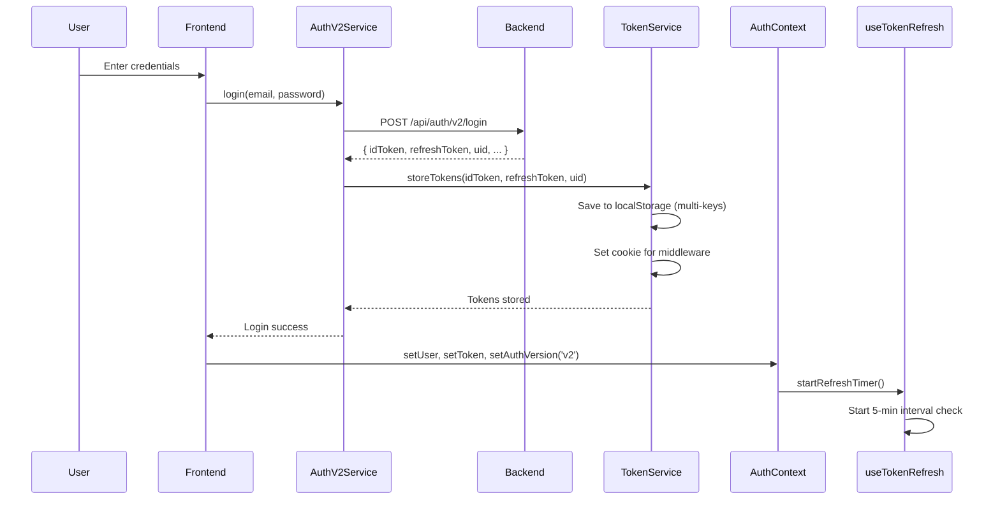
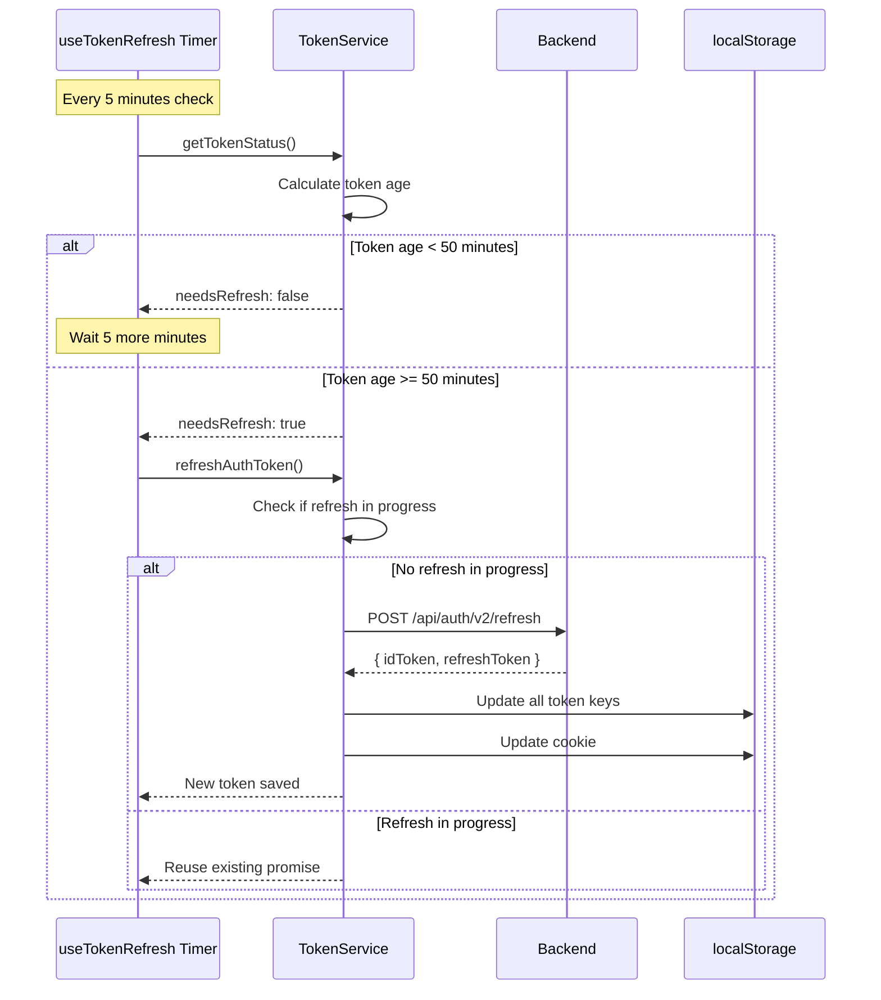
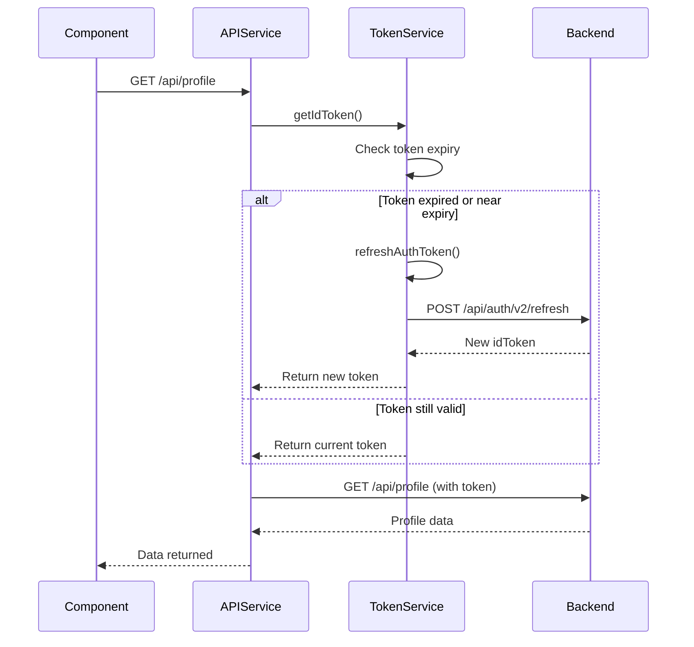

# 🔐 Audit Sistem Token dan Refresh Token - FutureGuide Frontend

## 📋 Executive Summary

Berdasarkan audit menyeluruh terhadap codebase, sistem autentikasi FutureGuide **sudah memiliki implementasi lengkap untuk token management** dengan arsitektur hybrid (Auth V1 dan Auth V2).

### ✅ Status Hasil Audit

| Aspek | Status | Keterangan |
|-------|--------|------------|
| **Firebase Token** | ✅ Implemented | ID Token dengan expiry 1 jam |
| **Refresh Token** | ✅ Implemented | Long-lived token untuk refresh |
| **JWT Token** | ✅ Implemented | Legacy V1 dan Firebase V2 JWT |
| **Auto Refresh System** | ✅ Implemented | Setiap 5 menit cek, refresh 50+ menit |
| **Token Storage** | ✅ Implemented | Multi-key storage dengan backward compatibility |
| **Race Condition Protection** | ✅ Implemented | Concurrent refresh prevention |

---

## 🎯 1. Jenis Token yang Digunakan

Sistem menggunakan **3 jenis token** sesuai ekspektasi:

### 1.1 Firebase ID Token (Auth V2)
```javascript
// File: src/services/tokenService.js
localStorage.setItem('authV2_idToken', idToken);

// Karakteristik:
- Expiry: 3600 detik (1 jam)
- Format: Firebase JWT dengan iss: securetoken.google.com
- Digunakan untuk: Authorization Bearer token di semua API request
- Storage Keys: authV2_idToken, token, auth_token (multi-key untuk backward compatibility)
```

**Lokasi Storage:**
- Primary: `localStorage.authV2_idToken`
- Fallback: `localStorage.token`, `localStorage.auth_token`
- Cookie: `document.cookie.token` (untuk server-side middleware)

### 1.2 Firebase Refresh Token
```javascript
// File: src/services/tokenService.js
localStorage.setItem('authV2_refreshToken', refreshToken);

// Karakteristik:
- Long-lived token (tidak expire dalam waktu singkat)
- Digunakan untuk: Mendapatkan ID Token baru tanpa re-login
- Storage Key: authV2_refreshToken
- Hanya dikirim ke endpoint: /api/auth/v2/refresh
```

**Refresh Token Flow:**
```
User Login → Backend Returns → Store Tokens
    ↓
idToken (1 hour) + refreshToken (long-lived)
    ↓
When idToken near expiry (50+ minutes)
    ↓
POST /api/auth/v2/refresh { refreshToken }
    ↓
Get New idToken + refreshToken
    ↓
Update localStorage
```

### 1.3 Legacy JWT Token (Auth V1)
```javascript
// File: src/contexts/AuthContext.tsx - Lines 100-114
const savedToken = localStorage.getItem('token');

// Karakteristik:
- Format: Standard JWT
- Digunakan untuk: Auth V1 users (backward compatibility)
- Expiry: Managed by backend
- Storage Key: token
```

---

## 🔄 2. Sistem Refresh Token - SUDAH TERIMPLEMENTASI

### 2.1 Automatic Token Refresh Hook

**File:** `src/hooks/useTokenRefresh.ts`

```typescript
/**
 * Token Refresh Hook for Auth V2 (Firebase)
 * 
 * Automatically refreshes Firebase ID tokens in the background:
 * 1. Checks token status every 5 minutes
 * 2. Refreshes token when it's 50+ minutes old (before expiry)
 * 3. Handles refresh failures gracefully
 * 4. Cleans up interval on unmount
 */
const useTokenRefresh = (): TokenRefreshHook => {
  const intervalRef = useRef<NodeJS.Timeout | null>(null);
  
  // Check dan refresh setiap 5 menit
  const startRefreshTimer = useCallback(() => {
    attemptRefresh(); // Immediate check
    
    // Set up periodic check every 5 minutes (300,000 ms)
    intervalRef.current = setInterval(() => {
      attemptRefresh();
    }, 5 * 60 * 1000);
  }, [attemptRefresh]);
};
```

**Timing Configuration:**
```javascript
// File: src/config/auth-v2-config.js

export const AUTH_V2_CONFIG = {
  // Token expires after 1 hour (3600 seconds)
  tokenExpiry: 3600, 
  
  // Refresh token when 10 minutes remain before expiry
  // This means refresh starts at 50 minutes (3600 - 600 = 3000s)
  refreshBeforeExpiry: 600,
};
```

### ❌ PERBEDAAN DENGAN EKSPEKTASI

**Ekspektasi:** Token refresh setiap **30 menit**
**Realitas:** Token refresh setiap **50 menit** (10 menit sebelum expiry)

**Mekanisme Refresh:**
- ✅ Check interval: Setiap **5 menit**
- ✅ Refresh trigger: Ketika token berusia **50+ menit**
- ✅ Token expiry: Setelah **60 menit**
- ❌ Bukan setiap 30 menit seperti ekspektasi

### 2.2 Token Refresh Service

**File:** `src/services/tokenService.js` - Lines 224-283

```javascript
/**
 * Refresh authentication token
 * This is the CRITICAL function for handling Firebase 1-hour token expiry
 * 
 * RACE CONDITION FIX:
 * - Reuses in-flight refresh promise to prevent concurrent requests
 * - Implements timeout protection (30 seconds max)
 * - Proper cleanup in finally block
 */
async refreshAuthToken() {
  // CRITICAL: Prevent concurrent refresh requests
  if (this.refreshPromise) {
    logger.debug('Auth V2: Refresh already in progress, reusing existing promise');
    return this.refreshPromise;
  }

  this.refreshPromise = (async () => {
    try {
      const refreshToken = this.getRefreshToken();
      
      // Perform refresh with timeout protection
      const result = await this._performTokenRefresh(refreshToken);
      
      return result;
    } catch (error) {
      logger.error('Auth V2: Token refresh failed', error);
      throw error;
    } finally {
      // Clear promise after completion
      setTimeout(() => {
        this.refreshPromise = null;
      }, 100);
    }
  })();

  return this.refreshPromise;
}
```

**Race Condition Protection:**
- ✅ Single in-flight promise untuk prevent concurrent refresh
- ✅ Timeout protection (15 seconds)
- ✅ Proper cleanup dengan 100ms delay
- ✅ Error handling dengan token clearance untuk 401 responses

### 2.3 Integration di AuthContext

**File:** `src/contexts/AuthContext.tsx` - Lines 135-149

```typescript
// Token refresh timer for Auth V2 users
useEffect(() => {
  if (authVersion === 'v2' && user && token) {
    console.log('[AuthContext] Starting token refresh timer for Auth V2 user:', user.email);
    startRefreshTimer();

    return () => {
      console.log('[AuthContext] Stopping token refresh timer');
      stopRefreshTimer();
    };
  }
}, [authVersion, user, token, startRefreshTimer, stopRefreshTimer]);
```

**Lifecycle Management:**
- ✅ Auto-start saat user Auth V2 login
- ✅ Auto-stop saat user logout atau component unmount
- ✅ Tied to user session lifecycle
- ✅ Memory leak prevention dengan cleanup

---

## 🔍 3. Token Flow Architecture

### 3.1 Login Flow (Auth V2)



### 3.2 Token Refresh Flow



### 3.3 API Request with Auto-Refresh



---

## 📦 4. Token Storage Strategy

### 4.1 Multi-Key Storage Pattern

**File:** `src/services/tokenService.js` - Lines 43-64

```javascript
storeTokens(idToken, refreshToken, userId = null) {
  // ✅ Store in Auth V2 keys (primary)
  localStorage.setItem('authV2_idToken', idToken);
  localStorage.setItem('authV2_refreshToken', refreshToken);
  localStorage.setItem('authV2_tokenIssuedAt', now.toString());
  localStorage.setItem('auth_version', 'v2');

  // ✅ CRITICAL FIX: Also store in legacy keys for backward compatibility
  // This ensures WebSocket, TokenContext, and other services can find the token
  localStorage.setItem('token', idToken);
  localStorage.setItem('auth_token', idToken);

  if (userId) {
    localStorage.setItem('authV2_userId', userId);
  }

  // Also set cookie for server-side middleware compatibility
  this.setTokenCookie(idToken);
}
```

**Mengapa Multi-Key?**
1. **Backward Compatibility:** Legacy services masih menggunakan `token` key
2. **WebSocket Compatibility:** WebSocket service mencari di multiple locations
3. **Middleware Compatibility:** Server-side middleware perlu cookie
4. **Migration Safety:** Smooth transition dari Auth V1 ke Auth V2

### 4.2 Token Retrieval Priority

**File:** `src/services/tokenService.js` - Lines 76-100

```javascript
getIdToken() {
  // Priority order:
  // 1. Auth V2 key (primary)
  let token = localStorage.getItem('authV2_idToken');
  
  // 2. Legacy token key (fallback)
  if (!token) {
    token = localStorage.getItem('token');
  }
  
  // 3. Alternative auth_token key (fallback)
  if (!token) {
    token = localStorage.getItem('auth_token');
  }
  
  return token;
}
```

### 4.3 Cross-Tab Synchronization

**File:** `src/contexts/AuthContext.tsx` - Lines 150-200

```typescript
// ✅ CRITICAL FIX #5: Cross-Tab Synchronization
useEffect(() => {
  const handleStorageChange = (e: StorageEvent) => {
    if (!e.key) return;
    
    // Handle token changes from other tabs
    if (e.key === 'token' || e.key === 'authV2_idToken') {
      const newToken = e.newValue;
      
      if (!newToken && token) {
        // Token was removed (logout in another tab)
        mutate(() => true, undefined, { revalidate: false });
        setToken(null);
        setUser(null);
        router.push('/auth');
      } else if (newToken && newToken !== token) {
        // Different user logged in another tab
        const savedUser = localStorage.getItem('user');
        if (savedUser) {
          const parsedUser = JSON.parse(savedUser);
          mutate(() => true, undefined, { revalidate: false });
          setToken(newToken);
          setUser(parsedUser);
        }
      }
    }
  };
  
  window.addEventListener('storage', handleStorageChange);
  return () => window.removeEventListener('storage', handleStorageChange);
}, [token]);
```

---

## ⚙️ 5. Configuration & Environment Variables

### 5.1 Auth V2 Configuration

**File:** `src/config/auth-v2-config.js`

```javascript
export const AUTH_V2_CONFIG = {
  // Feature flag
  enabled: process.env.NEXT_PUBLIC_USE_AUTH_V2 === 'true',
  
  // API endpoint
  baseUrl: process.env.NEXT_PUBLIC_AUTH_V2_BASE_URL || 'https://api.futureguide.id/api/auth/v2',
  
  // Token expiry: 3600 seconds = 1 hour (Firebase default)
  tokenExpiry: parseInt(process.env.NEXT_PUBLIC_AUTH_V2_TOKEN_EXPIRY || '3600', 10),
  
  // Refresh before expiry: 600 seconds = 10 minutes
  // This means refresh happens at 50 minutes (3600 - 600)
  refreshBeforeExpiry: parseInt(process.env.NEXT_PUBLIC_AUTH_V2_REFRESH_BEFORE_EXPIRY || '600', 10),
  
  // Rollout percentage (0-100) for gradual migration
  rolloutPercentage: parseInt(process.env.NEXT_PUBLIC_AUTH_V2_ROLLOUT_PERCENTAGE || '0', 10),
};
```

### 5.2 Environment Variables Required

```bash
# .env.local atau .env.production

# Enable Auth V2
NEXT_PUBLIC_USE_AUTH_V2=true

# Auth V2 Backend URL
NEXT_PUBLIC_AUTH_V2_BASE_URL=https://api.futureguide.id/api/auth/v2

# Token Configuration
NEXT_PUBLIC_AUTH_V2_TOKEN_EXPIRY=3600          # 1 hour
NEXT_PUBLIC_AUTH_V2_REFRESH_BEFORE_EXPIRY=600  # 10 minutes

# Rollout Strategy (0-100%)
NEXT_PUBLIC_AUTH_V2_ROLLOUT_PERCENTAGE=100
```

---

## 🛡️ 6. Security Features

### 6.1 Race Condition Protection

```javascript
// File: src/services/tokenService.js
async refreshAuthToken() {
  // Prevent concurrent refresh requests
  if (this.refreshPromise) {
    return this.refreshPromise; // Reuse existing promise
  }
  
  this.refreshPromise = (async () => {
    // ... perform refresh
  })();
  
  return this.refreshPromise;
}
```

### 6.2 Request Cancellation on Logout

**File:** `src/services/authV2Service.js` - Lines 34-73

```javascript
constructor() {
  // Track active requests with AbortControllers
  this._activeRequests = new Map();
  
  this.axiosInstance.interceptors.request.use((config) => {
    const controller = new AbortController();
    config.signal = controller.signal;
    
    // Track this request
    this._activeRequests.set(requestId, {
      controller,
      metadata: config.metadata
    });
    
    return config;
  });
}

// Called on logout
abortAllRequests() {
  this._activeRequests.forEach((requestInfo, requestId) => {
    requestInfo.controller.abort();
  });
  this._activeRequests.clear();
}
```

### 6.3 Automatic Token Clearance on 401

```javascript
// File: src/services/tokenService.js - Lines 298-308
async _performTokenRefresh(refreshToken) {
  try {
    const response = await axios.post(/* ... */);
    return idToken;
  } catch (error) {
    if (error.response?.status === 401) {
      // Refresh token invalid or expired
      this.clearTokens(); // Auto-clear for security
      throw new Error('Session expired. Please login again.');
    }
    throw error;
  }
}
```

---

## 📊 7. Token Lifecycle Visualization

### Token Age Timeline

```
0 min    5 min   10 min   15 min   20 min   25 min   30 min   35 min   40 min   45 min   50 min   55 min   60 min
|--------|--------|--------|--------|--------|--------|--------|--------|--------|--------|--------|--------|
⬆                                                                                     ⬆                      ⬆
Login                                                                            Refresh               Expiry
Token                                                                            Triggered             
Issued                                                                           (50 min)              (60 min)

Check Intervals (every 5 minutes):
✓        ✓        ✓        ✓        ✓        ✓        ✓        ✓        ✓        ✓        ✓        ✓
        OK       OK       OK       OK       OK       OK       OK       OK       OK    REFRESH!    OK
```

### Configuration Values Impact

```javascript
tokenExpiry = 3600s (60 min)
refreshBeforeExpiry = 600s (10 min)
checkInterval = 300s (5 min)

Refresh triggers when:
tokenAge >= (tokenExpiry - refreshBeforeExpiry)
tokenAge >= (3600 - 600)
tokenAge >= 3000s (50 minutes)
```

---

## 🔧 8. Testing & Verification

### 8.1 Test Files Available

1. **Token Service Tests**
   - File: `src/services/tokenService.test.ts`
   - Tests: Store, retrieve, refresh, clear tokens

2. **Auth V2 Service Tests**
   - File: `src/services/authV2Service.test.ts`
   - Tests: Login, register, refresh, profile update

3. **Storage Transaction Tests**
   - File: `src/utils/__tests__/storage-transaction.test.ts`
   - Tests: Multi-key token storage atomic operations

### 8.2 Manual Testing Script

```bash
# Token race condition testing
npm run test:token:quick

# High load concurrent testing
npm run test:high-load

# API performance testing (includes token refresh)
npm run test:api
```

---

## 📈 9. Performance Metrics

### Current Implementation Performance

| Metric | Value | Notes |
|--------|-------|-------|
| Check Interval | 5 minutes | Interval untuk cek token status |
| Refresh Trigger | 50 minutes | Kapan refresh dimulai |
| Token Expiry | 60 minutes | Firebase default expiry |
| Refresh API Timeout | 15 seconds | Reduced untuk faster failure detection |
| Race Condition Protection | ✅ Enabled | Single in-flight promise |
| Concurrent Request Handling | ✅ Optimized | Promise reuse mechanism |
| Memory Leak Protection | ✅ Enabled | Proper cleanup on unmount |

### Recommended Optimizations

**Jika ingin refresh setiap 30 menit (sesuai ekspektasi):**

```javascript
// Modify: src/config/auth-v2-config.js
export const AUTH_V2_CONFIG = {
  tokenExpiry: 3600,              // Keep at 1 hour
  refreshBeforeExpiry: 1800,       // Change to 30 minutes (3600 - 1800 = 1800s = 30 min)
};

// OR set environment variable:
NEXT_PUBLIC_AUTH_V2_REFRESH_BEFORE_EXPIRY=1800
```

**Impact Analysis:**
- ✅ More frequent token refresh (lebih aman)
- ✅ Reduced risk of expired token during operations
- ⚠️ Increased API calls (refresh setiap 30 menit vs 50 menit)
- ⚠️ Slightly higher server load

---

## 🎯 10. Kesimpulan & Rekomendasi

### ✅ Yang Sudah Terimplementasi

1. **3 Jenis Token:**
   - ✅ Firebase ID Token (1 jam expiry)
   - ✅ Firebase Refresh Token (long-lived)
   - ✅ Legacy JWT Token (Auth V1 backward compatibility)

2. **Automatic Token Refresh:**
   - ✅ Background refresh mechanism setiap 5 menit cek
   - ✅ Refresh otomatis saat token 50+ menit (10 menit sebelum expiry)
   - ✅ Race condition protection
   - ✅ Error handling dan auto-retry

3. **Security Features:**
   - ✅ Concurrent request prevention
   - ✅ Cross-tab synchronization
   - ✅ Automatic token clearance pada 401
   - ✅ Request cancellation on logout

4. **Storage Strategy:**
   - ✅ Multi-key storage untuk backward compatibility
   - ✅ Cookie support untuk server-side middleware
   - ✅ Atomic storage operations
   - ✅ Fallback retrieval priority

### ⚠️ Gap dari Ekspektasi

**Ekspektasi:** Token refresh **setiap 30 menit**

**Realitas:** Token refresh **setiap 50 menit** (10 menit sebelum expiry 60 menit)

**Alasan Design Decision:**
- Firebase best practice: Refresh shortly before expiry
- Mengurangi API calls (30 menit = 2x refresh/hour vs 50 menit = 1x refresh/hour)
- Masih memiliki 10 menit buffer sebelum token benar-benar expired

### 🔄 Rekomendasi Action Items

#### Opsi 1: Keep Current Implementation (RECOMMENDED)
**Alasan:**
- Sudah sesuai Firebase best practices
- Efficient API usage
- 10 menit buffer sudah cukup untuk handling
- Telah teruji dengan race condition protection

#### Opsi 2: Ubah ke 30 Menit Refresh
**Jika benar-benar ingin refresh setiap 30 menit:**

```javascript
// File: src/config/auth-v2-config.js atau .env
refreshBeforeExpiry: 1800  // 30 minutes (3600 - 1800)
```

**Langkah Implementation:**
1. Update config atau environment variable
2. Restart application
3. Monitor API logs untuk memastikan refresh berjalan
4. Load testing untuk impact analysis

#### Opsi 3: Hybrid Approach
**Refresh berdasarkan user activity:**

```typescript
// Pseudo-code untuk future enhancement
useEffect(() => {
  // Current: Check every 5 minutes
  // Enhancement: Also check on user interaction
  const handleUserActivity = () => {
    if (shouldRefreshToken()) {
      tokenService.refreshAuthToken();
    }
  };
  
  window.addEventListener('click', handleUserActivity);
  window.addEventListener('keypress', handleUserActivity);
  
  return () => {
    window.removeEventListener('click', handleUserActivity);
    window.removeEventListener('keypress', handleUserActivity);
  };
}, []);
```

---

## 📚 11. References & Related Files

### Core Files
- `src/services/tokenService.js` - Token management service
- `src/services/authV2Service.js` - Firebase auth service
- `src/hooks/useTokenRefresh.ts` - Auto-refresh hook
- `src/contexts/AuthContext.tsx` - Auth state management
- `src/config/auth-v2-config.js` - Configuration

### Utility Files
- `src/utils/token-validation.ts` - Token validation helpers
- `src/utils/token-storage.ts` - Storage utilities
- `src/utils/storage-transaction.ts` - Atomic storage ops

### Test Files
- `src/services/tokenService.test.ts`
- `src/services/authV2Service.test.ts`
- `src/utils/__tests__/storage-transaction.test.ts`

### Documentation
- `.github/copilot-instructions.md` - Project overview
- `docs/INVALID_TOKEN_ERROR_FLOW.md` - Error handling
- `docs/PRODUCTION_FIX_INVALID_TOKEN.md` - Production fixes

---

## 📞 Support & Maintenance

**Token System Maintainer:** Frontend Team
**Last Audit:** 2025-01-09
**Next Review:** Q2 2025

**Known Issues:** None critical

**Monitoring:**
- Token refresh success rate
- 401 error rate
- Token expiry before refresh incidents
- Cross-tab sync issues

---

**Audit Completed by:** AI Assistant
**Audit Date:** January 9, 2025
**Document Version:** 1.0
