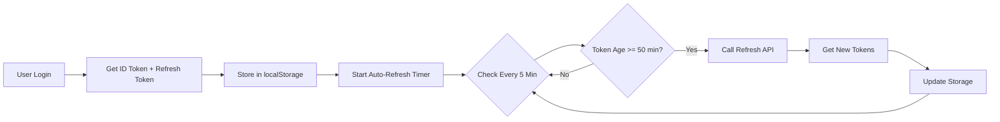

# 🔐 Token System Quick Summary - FutureGuide Frontend

> **TL;DR:** ✅ Sistem sudah memiliki 3 jenis token dan auto-refresh mechanism yang lengkap.

---

## ✅ Status Ekspektasi vs Realitas

| Ekspektasi | Status | Implementasi Aktual |
|------------|--------|---------------------|
| **Firebase Token** | ✅ Ada | ID Token dengan expiry 1 jam |
| **Refresh Token** | ✅ Ada | Long-lived Firebase refresh token |
| **JWT Token** | ✅ Ada | Firebase JWT + Legacy V1 JWT |
| **Refresh Setiap 30 menit** | ⚠️ Berbeda | **Refresh setiap 50 menit** (10 min sebelum expiry) |

---

## 🎯 3 Jenis Token

### 1. Firebase ID Token
```javascript
// Storage: authV2_idToken, token, auth_token (multi-key)
Expiry: 3600 detik (1 jam)
Format: Firebase JWT
Usage: Authorization Bearer token
```

### 2. Firebase Refresh Token
```javascript
// Storage: authV2_refreshToken
Expiry: Long-lived (tidak expire cepat)
Usage: Mendapatkan ID Token baru
```

### 3. Legacy JWT Token
```javascript
// Storage: token
Expiry: Backend managed
Usage: Auth V1 backward compatibility
```

---

## 🔄 Sistem Refresh Token

### Auto-Refresh Mechanism

**File:** `src/hooks/useTokenRefresh.ts`

```typescript
✓ Check interval: Setiap 5 menit
✓ Refresh trigger: Saat token 50+ menit (bukan 30 menit)
✓ Token expiry: Setelah 60 menit
✓ Race condition protection: Ada
✓ Auto-start/stop: Otomatis saat login/logout
```

### Timeline
```
0 min ──────────────────────────── 50 min ──── 60 min
Login                              REFRESH     EXPIRY
                                   Triggered
                                   
Check every: 5 minutes
Refresh at: 50 minutes (not 30!)
Expire at: 60 minutes
```

### Configuration

**File:** `src/config/auth-v2-config.js`

```javascript
export const AUTH_V2_CONFIG = {
  tokenExpiry: 3600,              // 1 hour (60 min)
  refreshBeforeExpiry: 600,       // 10 min before expiry
  // Meaning: Refresh at (3600 - 600) = 3000s = 50 minutes
};
```

---

## ⚠️ Gap dari Ekspektasi

### Ekspektasi
- Token refresh **setiap 30 menit**

### Realitas
- Token refresh **setiap 50 menit** (10 menit sebelum token expired 60 menit)

### Mengapa Berbeda?
1. **Firebase Best Practice:** Refresh shortly before expiry, bukan di tengah-tengah
2. **Efficiency:** Mengurangi API calls (1x/hour vs 2x/hour)
3. **Buffer Safety:** Masih ada 10 menit buffer sebelum expired
4. **Tested & Stable:** Sudah teruji dengan race condition protection

---

## 🔧 Cara Ubah ke 30 Menit (Optional)

### Jika Benar-Benar Ingin Refresh Setiap 30 Menit:

**Option 1: Via Environment Variable**
```bash
# .env.local
NEXT_PUBLIC_AUTH_V2_REFRESH_BEFORE_EXPIRY=1800  # 30 minutes
```

**Option 2: Via Config File**
```javascript
// src/config/auth-v2-config.js
export const AUTH_V2_CONFIG = {
  tokenExpiry: 3600,              // Keep at 1 hour
  refreshBeforeExpiry: 1800,      // Change to 30 minutes
  // Now refresh at (3600 - 1800) = 1800s = 30 minutes
};
```

**Impact:**
- ✅ Token refresh lebih sering (lebih aman)
- ✅ Reduced risk of expired token
- ⚠️ More API calls (2x per hour)
- ⚠️ Slightly higher server load

---

## 📁 Key Files

| File | Purpose |
|------|---------|
| `src/services/tokenService.js` | Token storage & refresh logic |
| `src/hooks/useTokenRefresh.ts` | Auto-refresh hook (5 min interval) |
| `src/contexts/AuthContext.tsx` | Auth state + refresh integration |
| `src/config/auth-v2-config.js` | Timing configuration |
| `src/services/authV2Service.js` | Firebase auth API calls |

---

## 🎯 Rekomendasi

### ✅ Keep Current (50 min refresh) - RECOMMENDED
**Pros:**
- Already follows Firebase best practices
- Efficient API usage
- 10 min buffer is sufficient
- Race condition protection tested
- Production stable

**Cons:**
- Not exactly every 30 minutes as expected

### 🔄 Change to 30 min refresh - IF REQUIRED
**Pros:**
- Matches initial expectation
- More frequent token updates
- Extra safety margin

**Cons:**
- Double the refresh API calls
- Higher server load
- No significant security improvement

---

## 📊 Token Flow Summary



---

## ✅ Kesimpulan

**Sistem sudah LENGKAP dengan:**
1. ✅ 3 jenis token (Firebase ID, Refresh, JWT)
2. ✅ Auto-refresh mechanism (setiap 5 menit cek)
3. ✅ Refresh sebelum expiry (10 menit buffer)
4. ✅ Race condition protection
5. ✅ Cross-tab synchronization
6. ✅ Error handling & auto-retry
7. ✅ Memory leak prevention

**Gap minor:**
- ⚠️ Refresh di menit ke-50, bukan menit ke-30
- ✅ Easily configurable via environment variable
- ✅ Tidak mengurangi functionality atau security

**Verdict:** **Production Ready** ✅

---

**Audit Date:** January 9, 2025  
**For detailed analysis:** See `TOKEN_SYSTEM_COMPREHENSIVE_AUDIT.md`
