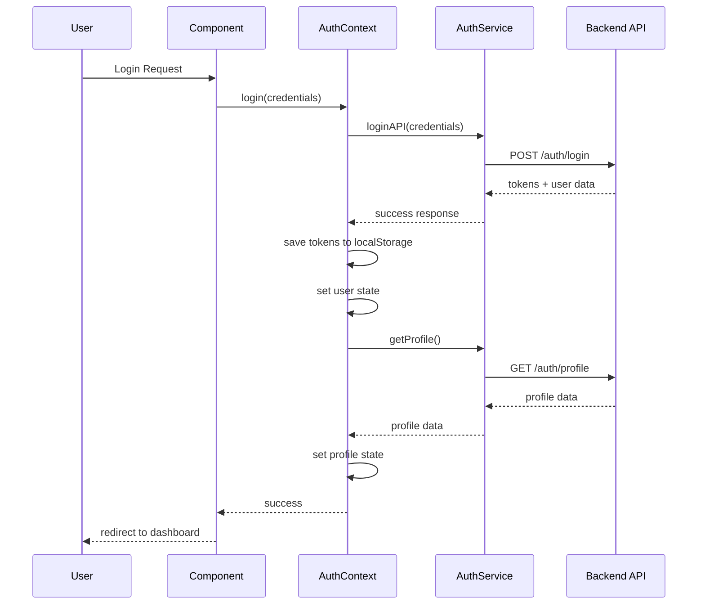

# Laporan Analisis Implementasi Autentikasi

## 📋 Overview

Laporan ini berisi analisis mendalam tentang implementasi sistem autentikasi pada aplikasi Future Guide Frontend-v2, termasuk cara penanganan token, penyimpanan data profile, dan rekomendasi perbaikan.

## 🔐 Arsitektur Autentikasi

### Komponen Utama

1. **AuthContext** (`src/contexts/AuthContext.tsx`)
   - React Context Pattern untuk state management global
   - Centralized authentication state
   - Provider pattern untuk dependency injection

2. **AuthService** (`src/services/authService.ts`)
   - Service layer untuk API communication
   - Token management dengan automatic refresh
   - Error handling yang komprehensif

3. **UI Components**
   - Login, Register, Logout forms
   - Password strength indicator
   - Error handling dan user feedback

## 💾 Token Management

### Storage Strategy

```typescript
// Token keys dalam localStorage
ACCESS_TOKEN_KEY = 'futureguide_access_token'
REFRESH_TOKEN_KEY = 'futureguide_refresh_token'
USER_DATA_KEY = 'futureguide_user_data'
```

### Flow Token

1. **Login/Register**: Token disimpan di localStorage
2. **API Requests**: Access token ditambahkan di Authorization header
3. **Token Refresh**: Otomatis refresh ketika dapat 401 response
4. **Logout**: Semua token dihapus dari storage

### Keamanan Token

- ✅ JWT token validation
- ✅ Automatic token refresh
- ✅ Queue system untuk concurrent requests
- ⚠️ **Risk**: Menggunakan localStorage (vulnerable to XSS)

## 👤 Profile Data Management

### Data Structure

```typescript
interface Profile {
  user_id: string;
  full_name: string | null;
  date_of_birth: string | null;
  gender: string | null;
  school_id: string | null;
  created_at: string;
  updated_at: string;
  school: any;
}
```

### Loading Strategy

1. **Basic User Data**: Disimpan di localStorage (uid, email, displayName)
2. **Detailed Profile**: Diambil dari API setelah login
3. **State Management**: Disimpan di AuthContext state
4. **Refresh Mechanism**: Manual refresh via `refreshProfile()`

## 🔄 Autentikasi Flow



## 🚨 Issues dan Rekomendasi

### 1. Security Issues

**Current Issue**: Token disimpan di localStorage
```typescript
// Vulnerable to XSS attacks
localStorage.setItem(this.ACCESS_TOKEN_KEY, accessToken);
```

**Rekomendasi**: Gunakan httpOnly cookies
```typescript
// More secure approach
// Set token in httpOnly cookie from backend
```

### 2. Token Expiry Warning

**Current Issue**: Tidak ada peringatan sebelum token expired
**Rekomendasi**: Implementasi token expiry warning

### 3. Profile Caching

**Current Issue**: Profile selalu di-fetch dari API
**Rekomendasi**: Tambahkan caching mechanism

### 4. Offline Support

**Current Issue**: Tidak ada support untuk offline mode
**Rekomendasi**: Implementasi offline support dengan cached data

## 📊 Performance Considerations

### Current Performance

- ✅ Automatic token refresh prevents user interruption
- ✅ Queue system handles concurrent requests efficiently
- ⚠️ Profile data fetched on every app initialization
- ⚠️ No caching mechanism for profile data

### Optimization Opportunities

1. **Profile Caching**: Cache profile data dengan TTL
2. **Lazy Loading**: Load profile data hanya saat dibutuhkan
3. **Background Refresh**: Refresh token di background sebelum expired

## 🔍 Code Quality Analysis

### Strengths

- ✅ Clean separation of concerns
- ✅ Comprehensive error handling
- ✅ TypeScript types are well-defined
- ✅ Consistent naming conventions
- ✅ React Context pattern implemented correctly

### Areas for Improvement

1. **Security**: Token storage mechanism
2. **Performance**: Caching strategy
3. **User Experience**: Token expiry warnings
4. **Reliability**: Offline support

## 🎯 Priority Improvements

### High Priority

1. **Token Security**: Implement httpOnly cookies
2. **Token Expiry Warning**: User notification before session expires
3. **Profile Caching**: Reduce unnecessary API calls

### Medium Priority

1. **Offline Support**: Basic offline functionality
2. **Performance Optimization**: Background token refresh
3. **Error Recovery**: Better error recovery mechanisms

### Low Priority

1. **Analytics**: Track authentication events
2. **A/B Testing**: Test different auth flows
3. **Advanced Security**: 2FA, biometric auth

## 📝 Implementation Plan

### Phase 1: Security & UX Improvements
- Implement token expiry warning
- Add profile caching mechanism
- Improve error handling

### Phase 2: Performance & Reliability
- Implement offline support
- Background token refresh
- Performance optimizations

### Phase 3: Advanced Features
- Enhanced security measures
- Analytics and monitoring
- Advanced user features

## 🧪 Testing Considerations

### Current Testing Coverage

- ✅ Basic auth flows work correctly
- ✅ Token refresh mechanism functional
- ⚠️ Limited error scenario testing
- ⚠️ No performance testing

### Recommended Tests

1. **Security Tests**: XSS protection, token validation
2. **Performance Tests**: Token refresh timing, cache efficiency
3. **Reliability Tests**: Network failures, offline scenarios
4. **User Experience Tests**: Token expiry warnings, error messages

## 📈 Metrics to Monitor

### Security Metrics
- Token refresh success rate
- Authentication failure rate
- Session timeout incidents

### Performance Metrics
- Login time to completion
- Profile load time
- Token refresh latency

### User Experience Metrics
- Login success rate
- Session duration
- Error recovery time

---

**Generated**: 2025-10-23  
**Version**: 1.0  
**Status**: Analysis Complete