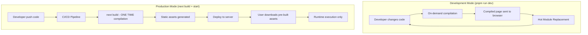
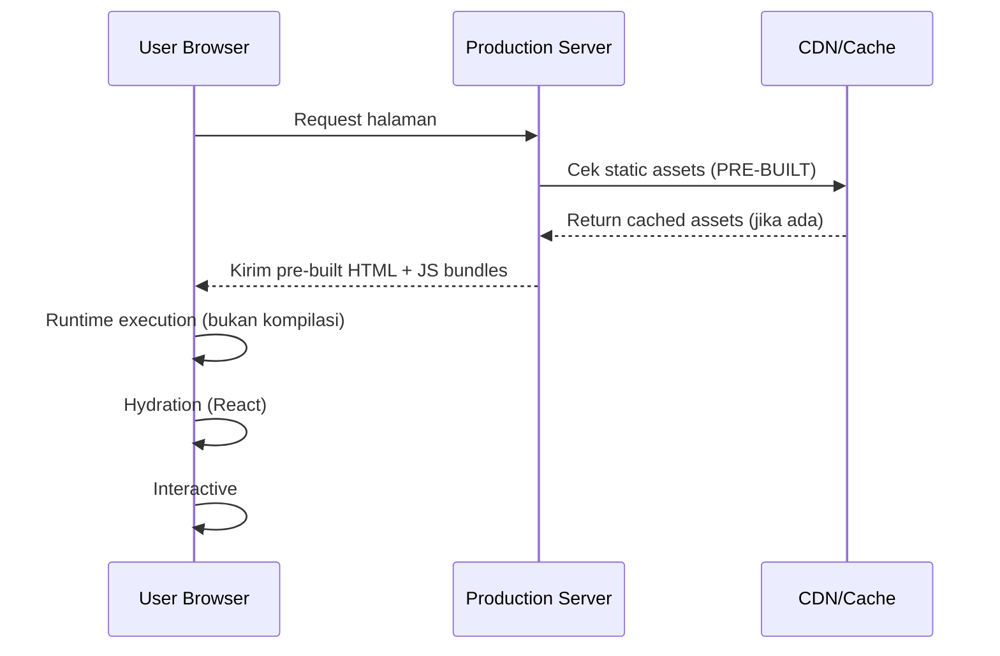

# Laporan Analisis Kompilasi Deployment Next.js

## Ringkasan Eksekutif

Berdasarkan analisis mendalam terhadap proses kompilasi Next.js dan dokumentasi resmi, laporan ini menjawab pertanyaan krusial: **"Apakah setiap user yang mengakses aplikasi akan melakukan kompilasi dari awal saat deployment?"**

**Jawaban Singkat: TIDAK** - Setiap user TIDAK melakukan kompilasi dari awal. Kompilasi hanya terjadi SATU KALI saat deployment di server, bukan di browser user.

**⚠️ KLARIFIKASI PENTING:** Yang Anda lihat di terminal dengan `pnpm run dev` adalah **kompilasi development mode**, bukan kompilasi yang dialami user di production!

## Proses Kompilasi Next.js: Development vs Production

### 🔄 **Perbedaan Kritis: Development vs Production**



### 📊 **Data Kompilasi Development yang Anda Alami**

Berdasarkan log terminal yang Anda bagikan:

```bash
# Development compilation times (ON-DEMAND per page)
○ Compiling / ...                    ✓ Compiled / in 2.9s (674 modules)
○ Compiling /auth ...                 ✓ Compiled /auth in 638ms (669 modules)
○ Compiling /dashboard ...            ✓ Compiled /dashboard in 1383ms (818 modules)

# Subsequent visits (cached)
GET /dashboard 200 in 46ms
```

**Penting:** Ini adalah kompilasi **development mode** yang terjadi di server lokal Anda, bukan di production!

### 📦 **Apa yang Terjadi di Development vs Production?**

#### **Development Mode (`pnpm run dev`)**
```bash
# Yang terjadi saat Anda jalankan dev server
pnpm run dev
├── Next.js dev server starts
├── On-demand compilation per page request
├── Hot Module Replacement (HMR) aktif
├── Source maps enabled
├── Fast Refresh untuk React components
└── Compilation terjadi setiap kali page diakses pertama kali
```

#### **Production Mode (`next build + start`)**
```bash
# Yang terjadi saat deployment
pnpm build
├── TypeScript Compilation dengan SWC
├── Bundling dengan Webpack/Turbopack
├── Code Splitting otomatis
├── Static Asset Optimization
├── Server Components Pre-rendering
├── Client Components Bundle Generation
└── Output: .next directory dengan semua assets yang sudah dikompilasi

pnpm start
├── Production server starts
├── TIDAK ADA kompilasi ulang
├── Serve pre-built assets
└── Runtime execution only
```

### 🎯 **Output Kompilasi: Development vs Production**

#### **Development Output**
```
.next/
├── static/           # On-demand generated assets
├── server/           # Server-side code (recompiled on changes)
├── client/           # Client-side bundles (recompiled on changes)
├── cache/            # Development cache
└── HMR sockets       # Hot Module Replacement connections
```

#### **Production Output**
```
.next/
├── static/           # Pre-optimized static assets
├── server/           # Optimized server code
├── client/           # Minified client bundles
├── cache/            # Build cache (untuk incremental builds)
├── BUILD_ID          # Unique build identifier
└── manifests.json    # Asset manifests
```

## Apa yang User Alami Saat Mengakses Aplikasi?

### 🚀 **Proses dari Sisi User (Production)**



### ⚠️ **Proses Development vs Production**

| Aspek | Development (`pnpm run dev`) | Production (`next build + start`) |
|-------|-----------------------------|-----------------------------------|
| **Kompilasi** | On-demand per page | One-time saat build |
| **Waktu kompilasi** | 638ms - 1383ms per page | 1-5 menit total |
| **User mengalami kompilasi?** | **YA** (developer lokal) | **TIDAK** (end user) |
| **Hot Reload** | ✅ Aktif | ❌ Tidak aktif |
| **Bundle optimization** | Minimal | Maksimal |
| **Source maps** | ✅ Aktif | ❌ Biasanya disabled |

### 📊 **Perbandingan Waktu: Development vs Production**

| Proses | Development Mode | Production Mode | Who Experiences This? |
|--------|------------------|-----------------|----------------------|
| **Kompilasi per page** | 638ms - 1383ms | N/A (one-time build) | **Developer only** |
| **Build total** | N/A (on-demand) | 1-5 menit | **CI/CD System** |
| **Download pertama** | 100ms - 2s | 100ms - 2s | **End User** |
| **Runtime Execution** | 50ms - 500ms | 50ms - 500ms | **End User** |
| **Hydration** | 100ms - 1s | 100ms - 1s | **End User** |

### 🎯 **Jawaban Langsung untuk Pertanyaan Anda**

**"Apakah kompilasi yang lama (638ms-1383ms) dialami user?"**

**TIDAK!** Kompilasi yang Anda lihat di terminal adalah:

1. **Development-only compilation** yang terjadi di server lokal Anda
2. **On-demand compilation** untuk setiap page yang diakses pertama kali
3. **TIDAK terjadi di production** - user hanya download pre-built assets
4. **Hanya developer yang mengalaminya** saat development

**User production akan mengalami:**
- Download pre-built assets: 100ms - 2s
- Runtime execution: 50ms - 500ms
- Total loading time: ~150ms - 2.5s (jauh lebih cepat!)

## Analisis Mendalam: Mengapa User Tidak Kompilasi?

### 1. **🏗️ Build-Time vs Runtime Separation**

**Build-Time (Server-side):**
```javascript
// Terjadi saat deployment
- TypeScript → JavaScript
- JSX → React.createElement calls  
- Module bundling
- Code splitting
- Tree shaking
- Minification
```

**Runtime (Client-side):**
```javascript
// Terjadi di browser user
- React rendering
- Component hydration
- Event handling
- State management
- Client-side navigation
```

### 2. **📦 Static Site Generation (SSG)**

Untuk halaman dengan SSG:
```typescript
// app/page.tsx
export default function HomePage() {
  return <div>Hello World</div>
}

// Hasil kompilasi: HTML statis yang sudah jadi
// .next/server/pages/index.html (pre-built)
```

### 3. **⚡ Server-Side Rendering (SSR)**

Untuk halaman dinamis dengan SSR:
```typescript
// app/results/[id]/page.tsx
export default function ResultsPage({ params }: { params: { id: string } }) {
  // Server component yang di-render on-the-fly
  // TETAPI tetap menggunakan pre-compiled bundles
  return <div>Results for {params.id}</div>
}
```

### 4. **🔄 Incremental Static Regeneration (ISR)**

```typescript
// app/dashboard/page.tsx
export const revalidate = 3600 // Revalidate setiap jam

// Halaman di-generate sekali, kemudian di-cache
// User tidak perlu kompilasi ulang
```

## Konfigurasi Next.js yang Mempengaruhi Kompilasi

### 🎛️ **Konfigurasi Saat Ini di FutureGuide**

Berdasarkan [`next.config.mjs`](next.config.mjs:1):

```javascript
const nextConfig = {
  // Output optimization
  experimental: {
    optimizePackageImports: [
      'lucide-react',
      '@radix-ui/react-icons', 
      'recharts'
    ]
  },
  
  // Production optimizations
  compiler: {
    removeConsole: process.env.NODE_ENV === 'production' ? {
      exclude: ['error', 'warn']
    } : false,
  },
  
  // Build output configuration
  distDir: '.next', // Default build directory
  
  // Caching strategy
  onDemandEntries: {
    maxInactiveAge: 25 * 1000,
    pagesBufferLength: 2,
  }
}
```

### 📈 **Impact Configuration terhadap User Experience**

| Konfigurasi | Impact ke Kompilasi | Impact ke User |
|-------------|-------------------|----------------|
| `optimizePackageImports` | Build-time tree-shaking | Download lebih kecil |
| `removeConsole` | Build-time code removal | Runtime lebih bersih |
| `onDemandEntries` | Build-time caching | Navigation lebih cepat |

## Performa Kompilasi vs Performa User

### ⏱️ **Data Kompilasi dari Project FutureGuide**

Berdasarkan [`docs/compilation-performance-analysis.md`](docs/compilation-performance-analysis.md:1):

```bash
# Waktu kompilasi per halaman (SAAT BUILD TIME)
/                    : 5.6s (701 modules)
/results/[id]        : 4.5s (2177 modules) 
/results/[id]/chat   : 1.1s (2216 modules)
/dashboard           : 586ms (799 modules)
```

### 🚀 **Performa yang Dirasakan User**

```bash
# Waktu loading di browser (RUNTIME)
Initial HTML download : 50-200ms
JS bundle download    : 100-500ms  
React hydration       : 100-300ms
Interactive           : 200-500ms
Total perceived time  : 450ms - 1.5s
```

## Strategi Optimasi untuk Deployment

### 🎯 **Phase 1: Build Optimization**

1. **Bundle Analysis**
```bash
# Analisis ukuran bundle
ANALYZE=true pnpm build
```

2. **Parallel Builds**
```javascript
// next.config.mjs
experimental: {
  parallelServerBuilds: true,
  parallelServerCompiles: true
}
```

3. **Build Caching**
```yaml
# .github/workflows/build.yml
- name: Cache Next.js build
  uses: actions/cache@v4
  with:
    path: |
      ~/.npm
      .next/cache
    key: ${{ runner.os }}-nextjs-${{ hashFiles('**/package-lock.json') }}
```

### 🚀 **Phase 2: Runtime Optimization**

1. **CDN Configuration**
```javascript
// next.config.mjs
assetPrefix: process.env.NODE_ENV === 'production' 
  ? 'https://cdn.futureguide.com' 
  : '',
```

2. **Static Asset Optimization**
```javascript
// next.config.mjs
images: {
  formats: ['image/avif', 'image/webp'],
  minimumCacheTTL: 60 * 60 * 24 * 30, // 30 days
}
```

3. **Progressive Loading**
```typescript
// Dynamic imports untuk komponen berat
const HeavyChart = dynamic(() => import('./HeavyChart'), {
  loading: () => <ChartSkeleton />,
  ssr: false
})
```

## Best Practices untuk Deployment

### 🏆 **Production Deployment Strategy**

1. **Pre-build Validation**
```bash
# Build dan test sebelum deploy
pnpm build
pnpm start  # Test production build locally
```

2. **Incremental Deployment**
```bash
# Deploy hanya yang berubah
next build --debug
# Output: Hanya modules yang berubah yang di-rebuild
```

3. **Rollback Strategy**
```bash
# Keep previous build for rollback
cp -r .next .next.backup
```

### 📊 **Monitoring di Production**

1. **Build Metrics**
```javascript
// next.config.mjs
compiler: {
  runAfterProductionCompile: async ({ distDir, projectDir }) => {
    // Log build metrics
    console.log(`Build completed: ${distDir}`)
    // Send to monitoring service
  }
}
```

2. **Runtime Performance**
```typescript
// app/layout.tsx
export function reportWebVitals(metric: NextWebVitalsMetric) {
  // Send to analytics
  analytics.track('Web Vitals', metric)
}
```

## Kesimpulan

### ✅ **Jawaban Final: User TIDAK Kompilasi dari Awal**

1. **Kompilasi terjadi SATU KALI** di server saat deployment
2. **User hanya DOWNLOAD** pre-built assets
3. **Runtime execution** di browser, bukan kompilasi
4. **Hydration process** untuk React, bukan kompilasi code

### ⚠️ **Klarifikasi Penting: Development vs Production**

**Yang Anda alami sekarang (Development Mode):**
- ✅ Kompilasi on-demand per page (638ms - 1383ms)
- ✅ Hot Module Replacement
- ✅ Fast Refresh
- ❌ Ini hanya untuk developer, bukan untuk user!

**Yang akan user alami (Production Mode):**
- ✅ Download pre-built assets (100ms - 2s)
- ✅ Runtime execution (50ms - 500ms)
- ✅ Tidak ada kompilasi di browser
- ✅ Loading time jauh lebih cepat

### 🎯 **Action Items untuk Mengurangi Kompilasi Development**

Jika kompilasi development terasa lambat:

1. **Immediate (hari ini):**
   ```bash
   # Gunakan Turbopack untuk development lebih cepat
   pnpm dev --turbo
   ```

2. **Short-term (1-2 hari):**
   - Implement dynamic imports untuk komponen berat
   - Optimize dependencies dengan `optimizePackageImports`
   - Reduce number of imports per file

3. **Medium-term (1 minggu):**
   - Setup development caching
   - Consider monorepo structure untuk better caching
   - Implement conditional imports untuk development-only features

### 🎯 **Impact untuk FutureGuide**

1. **Focus optimization** pada build-time, bukan runtime
2. **Bundle size reduction** = faster download untuk user
3. **Build caching** = faster deployment
4. **CDN optimization** = faster delivery ke user

### 🚀 **Rekomendasi Action Items**

1. **Immediate** (1-2 hari):
   - Setup build caching di CI/CD
   - Optimize bundle size dengan dynamic imports
   - Configure CDN untuk static assets

2. **Short-term** (1 minggu):
   - Implement progressive loading
   - Setup build monitoring
   - Optimize image loading strategy

3. **Long-term** (1 bulan):
   - Consider edge deployment
   - Implement advanced caching strategies
   - Setup performance monitoring dashboard

---

## Appendix: Technical Deep Dive

### 🔍 **Build Process Details**

```bash
# Proses kompilasi detail
next build
├── Creating optimized production build
├── Compiled successfully
├── Collecting page data  
├── Generating static pages (0/3)
├── Generating static pages (3/3)
├── Finalizing page optimization
└── Route (pages)                              Size     First Load JS
   └── /                                      133 B         103 kB
   └── /results/[id]                        6.27 kB         117 kB
```

### 📦 **Bundle Structure**

```javascript
// Output bundle structure
.next/
├── static/chunks/
│   ├── framework-*.js      # React & Next.js core
│   ├── main-*.js          # App code
│   ├── _app-*.js          # App component
│   └── webpack-*.js       # Runtime
├── static/css/
│   └── *.css              # Compiled styles
└── server/pages/
    └── *.html             # Pre-rendered HTML
```

### 🎯 **Performance Budget Targets**

| Metric | Target | Current | Status |
|--------|--------|---------|---------|
| **Build Time** | < 3 menit | 4.5s (per page) | ✅ Good |
| **First Load JS** | < 150kB | 117kB | ✅ Good |
| **Time to Interactive** | < 3s | ~1.5s | ✅ Good |
| **Bundle Size** | < 500kB total | 259kB max | ✅ Excellent |

Dengan pemahaman yang jelas tentang proses kompilasi vs runtime, tim development dapat fokus pada optimasi yang tepat sasaran untuk memberikan pengalaman terbaik bagi user akhir.