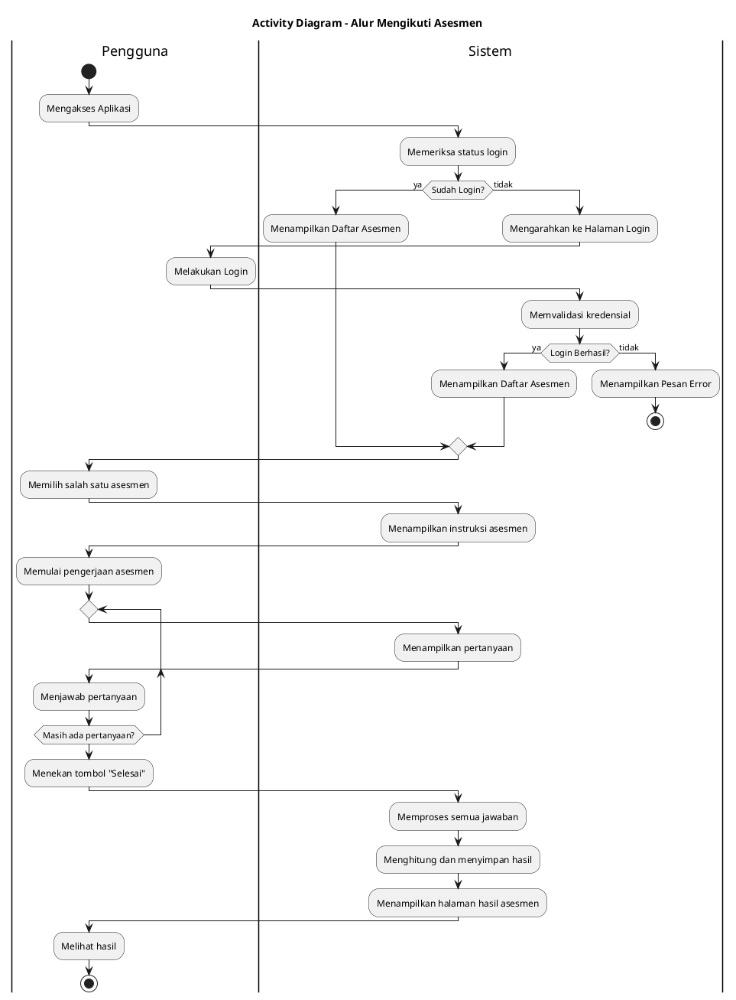

# Activity Diagram Aplikasi PetaTalenta (PlantUML)

Berikut adalah activity diagram yang menggambarkan alur kerja utama pengguna saat mengikuti asesmen di aplikasi PetaTalenta.

```plantuml
@startuml
title Activity Diagram - Alur Mengikuti Asesmen

|Pengguna|
start
:Mengakses Aplikasi;

|Sistem|
:Memeriksa status login;
if (Sudah Login?) then (ya)
  :Menampilkan Daftar Asesmen;
else (tidak)
  :Mengarahkan ke Halaman Login;
  |Pengguna|
  :Melakukan Login;
  |Sistem|
  :Memvalidasi kredensial;
  if (Login Berhasil?) then (ya)
    :Menampilkan Daftar Asesmen;
  else (tidak)
    :Menampilkan Pesan Error;
    stop
  endif
endif

|Pengguna|
:Memilih salah satu asesmen;

|Sistem|
:Menampilkan instruksi asesmen;

|Pengguna|
:Memulai pengerjaan asesmen;

repeat
  |Sistem|
  :Menampilkan pertanyaan;
  |Pengguna|
  :Menjawab pertanyaan;
repeat while (Masih ada pertanyaan?)

|Pengguna|
:Menekan tombol "Selesai";

|Sistem|
:Memproses semua jawaban;
:Menghitung dan menyimpan hasil;
:Menampilkan halaman hasil asesmen;

|Pengguna|
:Melihat hasil;
stop

@enduml
```
