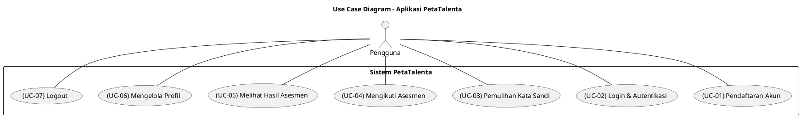

# Diagram Use Case Aplikasi PetaTalenta (PlantUML)

Berikut adalah diagram use case yang menggambarkan interaksi utama pengguna dengan sistem, dalam format PlantUML.

```plantuml
@startuml
title Use Case Diagram - Aplikasi PetaTalenta

actor "Pengguna" as User

rectangle "Sistem PetaTalenta" {
  usecase "(UC-01) Pendaftaran Akun" as UC1
  usecase "(UC-02) Login & Autentikasi" as UC2
  usecase "(UC-03) Pemulihan Kata Sandi" as UC3
  usecase "(UC-04) Mengikuti Asesmen" as UC4
  usecase "(UC-05) Melihat Hasil Asesmen" as UC5
  usecase "(UC-06) Mengelola Profil" as UC6
  usecase "(UC-07) Logout" as UC7
}

' -- Interaksi Pengguna dengan Sistem --
User -- UC1
User -- UC2
User -- UC3
User -- UC4
User -- UC5
User -- UC6
User -- UC7

@enduml
```
